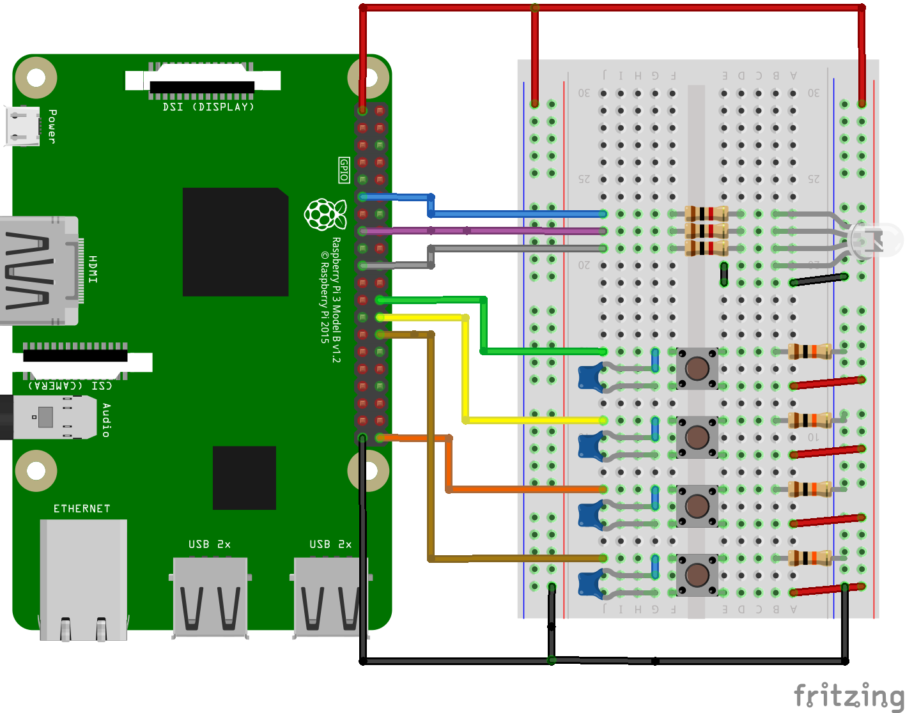

<!-- PROJECT LOGO -->
<br />
<p align="center">
  <a href="https://github.com/RBOLDI/embeddedWeek2">
    
  </a>

  <h3 align="center">Embedded Week 2</h3>

</p>

<!-- ABOUT THE PROJECT -->
## About The Project
This is the repository for the Embedded System Engineering project provided by the Amsterdam University of Applied Sciences. This repo contains all the assignments from project week two.

<!-- HOOKUP -->
## Hooking up components
<p align="center">
  </br>
  <a href="https://github.com/RBOLDI/embeddedWeek2">
    
  </a>
</p>

<!-- GETTING STARTED -->
## Getting Started
### Usage

1. Clone the repo
```sh
git clone https://github.com/RBOLDI/embeddedWeek2.git
```
2. Launch one of the assigments
```sh
cd launch_scripts
./launch_opdracht1_.sh
```
```sh
cd launch_scripts
./launch_opdracht2_.sh
```
```sh
cd launch_scripts
./launch_opdracht3_.sh
```
```sh
cd launch_scripts
./launch_opdracht4_.sh
```
```sh
cd launch_scripts
./launch_opdracht5_.sh
```
```sh
cd launch_scripts
./launch_opdracht6_.sh <command>
```
<p align="center">
  </br></br>
  <a href="https://github.com/RBOLDI/embeddedWeek2">
    
  </a>
</p>
